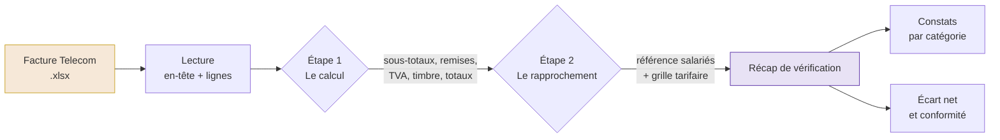
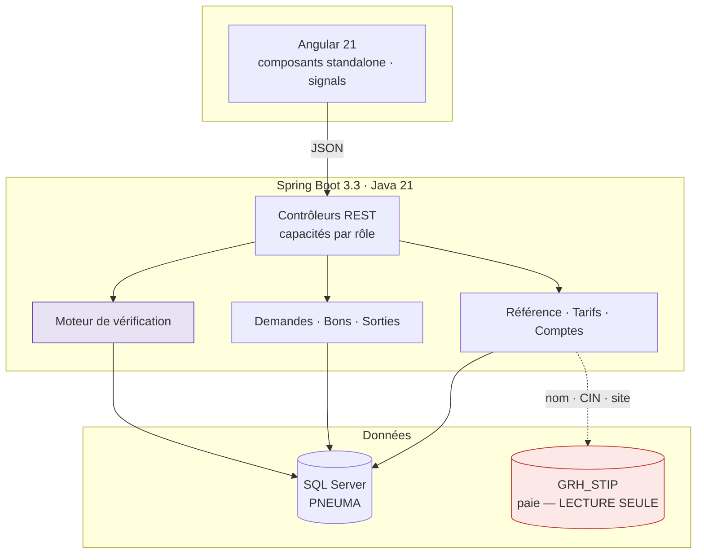

<div align="center">

# AMINE

**Contrôle automatisé des factures Tunisie Telecom — STIP**

*Chaque mois, une facture de plusieurs centaines de lignes. Chaque ligne, un salarié, un forfait, une retenue sur salaire. Vérifier tout cela à la main prend des jours et laisse passer des erreurs. AMINE le fait en quelques secondes, et dit exactement ce qui cloche.*


</div>

---

## Le problème

STIP met des lignes mobiles à disposition de ses salariés. Tunisie Telecom facture l'entreprise ; l'entreprise retient la part due sur les salaires. Entre les deux, personne ne garantissait que les deux colonnes correspondaient.

Le contrôle se faisait sur un classeur Excel, à la main, ligne par ligne. Il était donc :

| | |
|---|---|
| **long** | plusieurs centaines de lignes chaque mois, sur quatre comptes |
| **partiel** | on vérifie ce qu'on regarde ; on ne regarde pas tout |
| **muet sur l'absent** | une ligne facturée pour quelqu'un qui a quitté l'entreprise ne saute pas aux yeux |
| **non reproductible** | aucune trace de ce qui avait été contrôlé, ni comment |

Le premier passage automatisé sur une facture réelle a isolé **30 numéros facturés sans titulaire dans la référence**, soit **672,548 DT** sur un seul mois — invisibles au contrôle manuel.

---

## Ce que fait la plateforme



La vérification se lit comme **deux questions successives**, dans cet ordre :

1. **La facture est-elle juste en elle-même ?** Les lignes d'un numéro s'additionnent-elles à son sous-total ? Les remises correspondent-elles à leur pourcentage ? La TVA, le timbre et le total général sont-ils cohérents ? Le bon contrat est-il appliqué ?
2. **Correspond-elle à nos salariés ?** Chaque numéro facturé est-il dans la référence ? Chaque numéro de la référence est-il facturé ? Le forfait facturé est-il celui que nous avons enregistré ?

Un écart n'est jamais masqué : les différences au millime sont classées « arrondi » et comptées à part, mais restent visibles.

---

## Les règles métier qui comptent

Ce sont elles qui font la valeur de l'outil — elles ont été reconstituées à partir des factures réelles et validées avec la DSI et les RH.

<details>
<summary><b>Facturation et tarification</b></summary>

- **TVA 19 %**, puis **droit de timbre 14 %** appliqué sur (HT + TVA).
- Remises sur facture : **25 %** sur l'ancien contrat (`RPF25F`, `PRD25`), **50 %** sur le nouveau (`P50%`).
- Forfaits à prix fixe : `FNACO` 84,746 · `CO021` 21,187 · `F3AYP` 16,807 · `FOS03` par bloc de 8,4746.
- Le forfait Ayelti est offert à 100 % : `R3A100 = (1 − remise) × F3AYP`.
- Un forfait peut être présenté **au prix catalogue** ou **déjà remisé** : les deux sont acceptés, ils sont équivalents au net.
- Les lignes partielles sont **proratisées** ; certaines options restent facturées au tarif plein.

</details>

<details>
<summary><b>Date d'effet — la règle du terme échu</b></summary>

Telecom facture à terme échu : **une facture datée du 1er juin porte la consommation de mai**.

Un changement de forfait approuvé n'est donc pas facturable immédiatement. La date d'effet est fixée au **1er du mois M+2** : approuvé en juin → nouvelle consommation en juillet → première facture au 1er août.

Conséquence directe sur la vérification : tant que la date d'effet n'est pas atteinte, la facture est contrôlée **contre l'ancien forfait**. Le montant gelé est conservé pour cela.

</details>

<details>
<summary><b>Bons d'achat et engagement</b></summary>

La contrepartie de l'engagement, c'est le bon d'achat (subvention Telecom, `forfait × 9`).

- **Pas de bon reçu → pas d'engagement opposable.** Le salarié peut résilier sans devoir le reliquat.
- **Bon reçu → l'engagement doit être servi**, même en cas de résiliation.

Les bons arrivent **par lots**, et Telecom réémet le **lot entier** dès qu'un seul bon est erroné : la validation se fait donc au niveau du lot, par le directeur DSI.

</details>

<details>
<summary><b>Sortie au compte</b></summary>

Quand un agent quitte l'entreprise, le solde de son engagement lui est prélevé **en une fois** sur son solde de tout compte, au lieu des retenues mensuelles.

Sa ligne est alors dans un troisième état, ni actif ni inactif :

- **pas actif** — il n'est plus en paie, il n'y a plus de retenue mensuelle à rapprocher ;
- **pas inactif** — Telecom continue légitimement de facturer jusqu'au terme, et c'est déjà payé.

La ligne reste donc **attendue et contrôlée** (si Telecom facture plus que le forfait prélevé, la différence est à la charge de STIP), mais **exclue de l'écart net**. À la fin de l'engagement, elle bascule automatiquement en inactif.

</details>

<details>
<summary><b>Cloisonnement par site</b></summary>

Chaque demande et chaque employé porte son site (Siège, Msaken, Menzel Bourguiba). Un RH de site ne voit que son site ; le Siège et la DSI voient tout. Le contrôle **échoue fermé** : en cas de doute sur le site, l'accès est refusé.

</details>

---

## Architecture



> [!IMPORTANT]
> La base de paie **GRH_STIP** est accédée en **lecture seule, sans exception**. Elle sert uniquement à retrouver l'identité et le site d'un salarié. Aucune écriture, jamais.

Le frontend est **compilé dans le JAR** : le déploiement est un artefact unique, `pneuma.jar`, servi par le Tomcat embarqué.

---

## Stack

| Couche | Choix | Pourquoi |
|---|---|---|
| Backend | Spring Boot 3.3.5 · Java 21 | records, `switch` à motifs, texte en blocs |
| Persistance | JPA / Hibernate · SQL Server 2019 | imposé par la DSI ; H2 en développement |
| Lecture Excel | Apache POI | factures Telecom et listes de référence en `.xlsx` |
| Frontend | Angular 21 · standalone · signals | pas de store externe, état local et typé |
| Style | CSS natif · OKLCH | aucun framework UI, thème cohérent et sobre |
| PDF | OpenPDF | rapports et bons d'achat |
| Service | NSSM | exécution en service Windows sur le VM |

---

## Démarrer en local

```bash
# Backend — H2 en fichier, aucune installation de base requise
cd backend
mvn spring-boot:run
# → http://localhost:8080   (admin / admin123 au premier démarrage)

# Frontend — rechargement à chaud, proxy vers le backend
cd frontend
npm install
npm start
# → http://localhost:4200
```

**Build de production** (frontend compilé dans le JAR) :

```powershell
.\build-prod.ps1
# → backend/target/pneuma.jar
```

---

## Déploiement

```powershell
# Sur le VM, PowerShell administrateur
.\deploy-vm.ps1 -NouveauJar "C:\Pneuma\depot\pneuma.jar"
```

Le script sauvegarde le JAR en place, arrête le service, remplace, redémarre, puis **vérifie que l'application répond** — et **restaure automatiquement la version précédente** si ce n'est pas le cas.

La configuration sensible (mots de passe SQL Server, SMTP, admin) vit dans `C:\Pneuma\config\application.yml`, **à côté** du JAR et **hors du dépôt**. Voir [`backend/deploy/config/application.yml.example`](backend/deploy/config/).

---

## Structure

```
stip-rapprochement/
├── backend/
│   └── src/main/java/tn/stip/rapprochement/
│       ├── verification/    ← le moteur : contrôles de calcul + rapprochement
│       ├── facture/         ← lecture, rapports, export Excel/PDF
│       ├── flotte/          ← référence des numéros salariés
│       ├── pro/             ← référence des numéros professionnels
│       ├── stc/             ← sorties au compte
│       ├── workflow/        ← demandes, bons d'achat, lots
│       ├── paie/            ← accès LECTURE SEULE à GRH_STIP
│       └── auth/            ← comptes, rôles, capacités
├── frontend/src/app/
│   ├── pages/               ← un composant par écran
│   └── core/                ← services, modèles, composants partagés
└── docs/
    ├── uml/                 ← diagrammes (PlantUML)
    └── *.pdf                ← dossier de direction, aide-mémoire RH
```

---

## Résultats

| | |
|---|---|
| **672,548 DT** | détectés sur une seule facture — 30 numéros facturés hors référence |
| **~49 lignes** | résiliées auprès de Telecom sur la base des rapprochements, confirmé par l'opérateur |
| **27 factures** | rejouées pour valider le moteur (TVA 27/27, timbre 26/27) |
| **quelques secondes** | pour ce qui prenait plusieurs jours |

---

<div align="center">
<sub>Développé pour la Société Tunisienne des Industries de Pneumatiques — stage d'ingénieur, ESPRIT.</sub>
</div>
